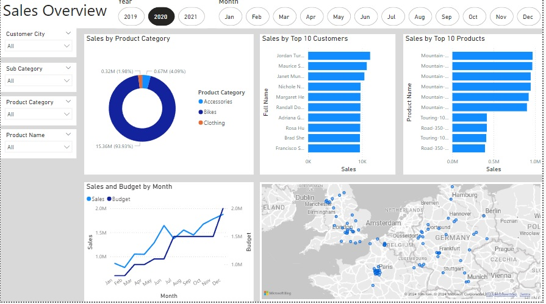
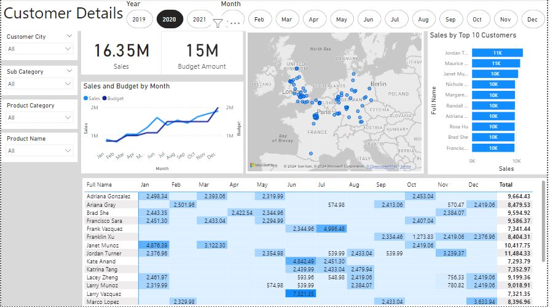
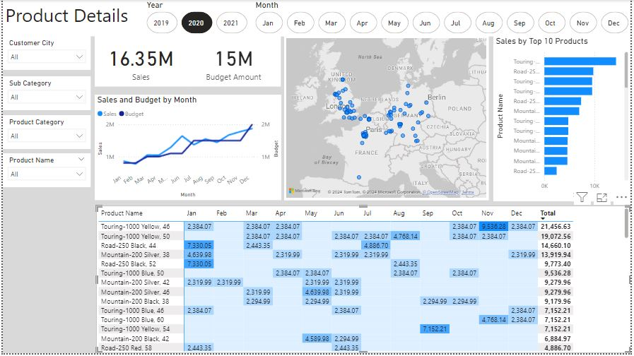

# Sales Insights Dashboard

The Sales Insights Dashboard was created to provide a comprehensive view of sales performance across multiple dimensions such as time, products, and customer demographics. Built using Power BI and connected to the AdventureWorks Data Warehouse, this dashboard enables business users to explore sales trends, identify key revenue drivers, and make informed data-driven decisions.

## Key Features

- **Sales Trends Over Time**:
The dashboard highlights sales performance over time, allowing users to analyze sales growth patterns.
Features a year-over-year (YoY) comparison to quickly identify sales spikes or declines.
Interactive time filters help focus on specific periods (monthly, quarterly, yearly).

- **Product Category Performance**:
Provides insights into sales based on product categories.
Visualizes top-selling product lines and allows drill-down into individual products for further analysis.
Sales trends by product types reveal the most profitable categories.

- **Customer Demographics**:
Shows sales performance segmented by customer demographics such as age, location, and income group.
Helps in understanding customer preferences across different regions or age groups.

- **Regional Sales Performance**:
Geographical heatmaps display sales by region, helping businesses to assess market performance.
Regional comparisons allow users to spot high-performing locations or areas needing improvement.

- **Key Sales Metrics**:
Provides KPIs such as Total Sales, Profit Margin, Average Order Value, and Customer Lifetime Value.
A quick-glance section for tracking overall business health and growth trajectory.

- **Interactive Filters**:
Multiple filters for exploring specific aspects of the data: product types, regions, customer segments, and time periods.
Enables business users to customize their view and focus on specific areas of interest.

## Technology & Tools Used

- **Power BI**: Created an interactive dashboard with data visualizations and custom calculations using DAX.
- **SQL**: Extracted and cleaned data from the AdventureWorks Data Warehouse.
- **Data Cleaning & Transformation**: Processed raw data to ensure quality and reliability, applying business rules to remove inconsistencies.
- **DAX (Data Analysis Expressions)**: Implemented calculated columns and measures for custom metrics like profit margins, growth percentages, and YoY comparisons.
 

**Sales Overview:**

 

**Customer Details:**

 **Product Details:**

## Impact
- Helped the sales team identify underperforming product categories and regions.
- Provided key insights that led to a targeted marketing strategy, improving overall sales performance.
- The dashboard significantly reduced the time spent on generating manual reports, allowing decision-makers to focus on strategic initiatives.

## SQL Queries Used
- SQL queries were used to extract and clean data from the AdventureWorks Data Warehouse.
- [View SQL Queries](./sql/)

## Project Files
- Download the Power BI Dashboard: [Sales Insights Project.pbix](./files/Sales_Insights_project.pbix)

## Future Improvements
- Add a predictive analysis component to forecast future sales using machine learning algorithms.
- Enhance the customer segmentation analysis by integrating external demographic data.
- Build a more detailed product profitability analysis by incorporating cost data.

## Conclusion
This Sales Insights Dashboard provides a comprehensive and dynamic view of sales performance, offering business users the ability to explore and analyze critical sales data with ease. By integrating interactive visualizations and key metrics, the dashboard enhances decision-making capabilities and helps drive business growth.

## Contact
Feel free to reach out if you have any questions or feedback!
- **Email**: reyhaanbinny97@gmail.com
- **LinkedIn**: https://www.linkedin.com/in/reyhaanbinny

